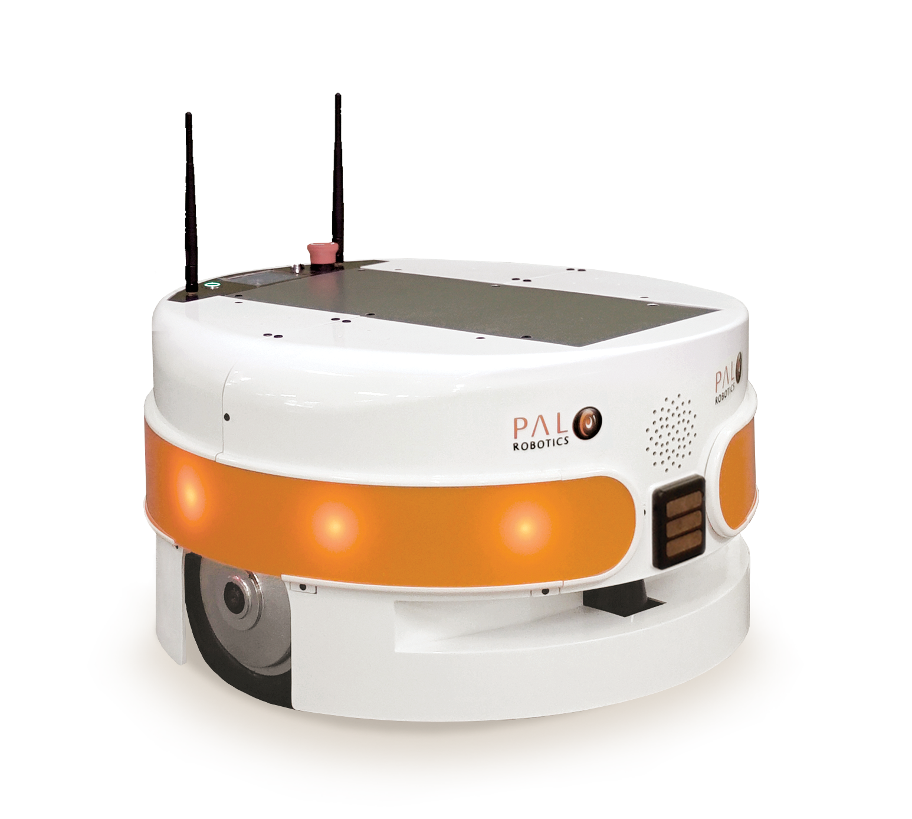
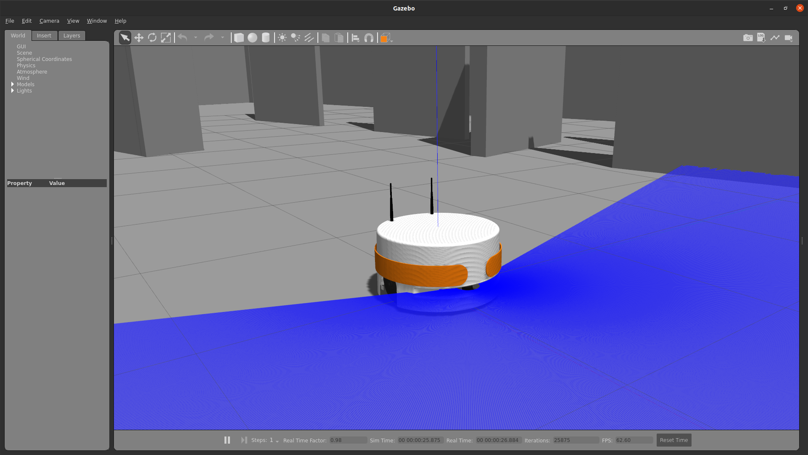
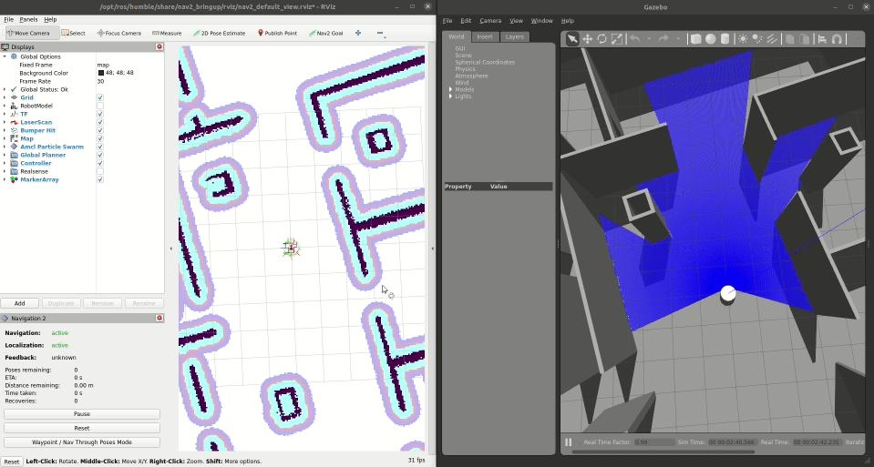

PMB2 ROS 2 Simulation
==================

This repository contains the launch files to simulate the PMB2/TIAGo Base robot in ROS 2.




## Setup

### Prerequisites

1. Install ROS 2 Humble by following the [installation instructions](https://docs.ros.org/en/humble/Installation/Ubuntu-Install-Debians.html).

2. Update the apt package index and install needed packages

```console
sudo apt-get update

sudo apt-get install git python3-vcstool python3-rosinstall python3-rosdep python3-colcon-common-extensions
```

> **Disclaimer**: In our testing environment, we've found out that the simulation is more reliable if we switch to Cyclone DDS. You can do this by installing it with `sudo apt install ros-humble-rmw-cyclonedds-cpp` and setting the `RMW_IMPLEMENTATION` environment variable: `export RMW_IMPLEMENTATION=rmw_cyclonedds_cpp`. More information on working with different DDS implementations [here](https://docs.ros.org/en/humble/How-To-Guides/Working-with-multiple-RMW-implementations.html).
>
> We are still looking on the issues when working with Fast RTPS.


### Setting up the workspace

Create a workspace and clone all repositories:

```console
mkdir -p ~/pmb2_public_ws/src
cd ~/pmb2_public_ws
vcs import --input https://raw.githubusercontent.com/pal-robotics/pmb2_tutorials/humble-devel/pmb2_public.rosinstall src
```

Install dependencies using rosdep

```console
sudo rosdep init
rosdep update
rosdep install --from-paths src -y --ignore-src
```

Source the environment and build

```console
source /opt/ros/humble/setup.bash
colcon build --symlink-install
```

Finally, before running any application you have to source the workspace

```console
source ~/pmb2_public_ws/install/setup.bash
```

Also you can add it to your .bashrc


## Simulation

### Standalone

Launch gazebo simulation:

```console
ros2 launch pmb2_gazebo pmb2_gazebo.launch.py
```



To move the robot you can use the following command from another terminal:

```console
ros2 topic pub /mobile_base_controller/cmd_vel_unstamped geometry_msgs/msg/Twist '{linear: {x: 1}, angular: {z: 0}}' -r10
```

The velocities can be modified by changing the values of x and z.


### Navigation 2

You can launch PMB2 navigation by executing 

```console
ros2 launch pmb2_2dnav pmb2_nav_bringup.launch.py
```

Then, you can send a goal with rviz2




### Simulation + Navigation 2

You can also start the simulation and navigation together by using

```console
ros2 launch pmb2_2dnav_gazebo pmb2_navigation_gazebo.launch.py
```

Then, rviz2 can be used in the same way.
